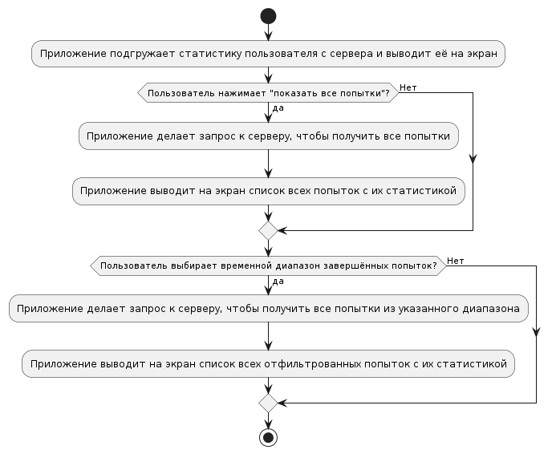

# Функциональные модели

## Диграмма вариантов:

* [оффлайн файл](diagrams/variants.puml)

## Регистрация
Пользователь: вводит данные для регистрации (имя, почта, пароль, подтверждение пароля)       
Приложение:        
    - проверяет введённые данные на валидность (используя регулярные выражения, проверка по шаблону почты) на стороне клиента       
    - отправляет json файл с введёнными данными на сервер       
    - проверяет валидацию (используя регулярные выражения, проверка по шаблону почты) на стороне сервера       
    - если нет пользователя с таким email, то вносит данные в базу данных, иначе выводит сообщение об уникальности почты       
    - перенаправляет пользователя в лобби игры       

* [оффлайн файл](diagrams/regist.puml)

## Авторизация       
Пользователь: вводит данные для авторизации (почта, пароль)       
Приложение:        
    - проверяет введённые данные на валидность (используя регулярные выражения, проверка по шаблону почты) на стороне клиента       
    - отправляет json файл с введёнными данными на сервер       
    - проверяет валидацию (используя регулярные выражения, проверка по шаблону почты) на стороне сервера       
    - делает запрос к серверу, для проверки данных пользователя       
    - в случае успеха, перенаправляет пользователя в лобби игры, иначе выводит сообщение о неправильных данных       

* [оффлайн файл](diagrams/auth.puml)

## Главное меню игры       
Пользователь: нажимает кнопку "играть" и переходит в режим игры       
Приложение: перенаправляет пользователя на страницу с игрой       

Пользователь: нажимает кнопку "статистика", и переходи в меню статистики       
Приложение: перенаправляет пользователя на страницу со статистикой       

Пользователь: нажимает на иконку личного кабинета       
Приложение: открывает модальное окно с личными данными пользователя       

## Личный кабинет       
Пользователь: вносит изменения в одно из полей данных       
Приложение:       
    - проверяет введённые данные на валидность (используя регулярные выражения, проверка по шаблону почты) на стороне клиента       
    - отправляет json файл с введёнными данными на сервер       
    - проверяет валидацию (используя регулярные выражения, проверка по шаблону почты) на стороне сервера       
    - в случае успеха, обновляет данные пользователя       
    - в личном кабинете выводит обновлённые данные       

Пользователь: нажимает на переключатель музыки       
Приложение: включает/выключает фоновую музыку       

* [оффлайн файл](diagrams/lk.puml)

## Режим игры       
Приложение:        
    - делает GET запрос на сервер, чтобы получить текст       
    - выводит текст на экран       
Пользователь: начинает ввод текста       
Приложение:        
    - проверяет правильность ввода текста       
    - если буква введена верно, то подсвечивает её зелёным, иначе красным       

Пользователь: вводит последний символ в тексте       
Приложение:       
    - проверяет этот символ на правильность и подсвечивает нужным цветом       
    - выводит статистику о завершённой попытке на экран       
    - отправляет данные о завершённой попытке на сервер       

Пользователь: нажимает кнопку "играть дальше"       
Приложение: начинает игру с начала       

Пользователь: нажимает кнопку "вернуться в главное меню"       
Приложение: перенаправляет пользователя в главное меню       

* [оффлайн файл](diagrams/gm.puml)

## Меню статистики       
Приложение: подгружает статистику пользователя с сервера и выводит её на экран       
Пользователь: нажимает "показать все попытки"       
Приложение:        
    - делает запрос к серверу, чтобы получить все попытки       
    - выводит на экран список всех попыток с их статистикой       
Пользователь: выбирает временной диапазон завершённых попыток       
Приложение:        
    - делает запрос к серверу, чтобы получить все попытки из указанного диапазона       
    - выводит на экран список всех отфильтрованных попыток с их статистикой        

* [оффлайн файл](diagrams/stats.puml)

    
